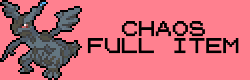
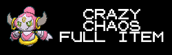
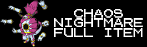

# EmoTracker pack for Pokémon Crystal Randomizers

Based on the tracker by StormRider, modified by DillonIsMyName and Vicendithas

It's an EmoTracker pack with map for\
[ERC's Pokémon Crystal Item Randomizer](https://github.com/erudnick-cohen/Pokemon-Crystal-Item-Randomizer)

## Requirements
[EmoTracker](https://emotracker.net/)

## Installation

1. Download through the Package Manager in EmoTracker.

OR

1. Download the latest release from the Releases section on GitHub.
2. Place the downloaded zip file in the EmoTracker packs directory (defaults to ``My Documents\EmoTracker\packs``).

OR (for the development version)

1. Clone the repository to your computer
2. Place the downloaded zip file (or directory) in the EmoTracker packs directory (defaults to ``My Documents\EmoTracker\packs``). Note: if you download a zip of the repository, you may need to unzip it first.

## Usage

This tracker has a wide variety of variants to support the options available in ERCs Crystal Item Randomizer, including the following features:

1. A map containing locations of items and badges to acquire.
2. A tracker of items and badges acquired
3. Maps of several caves to help find items or traverse without Flash
4. Settings options for various randomization features
5. Preset buttons to quickly set the options

It is recommended to turn on Fast Tool Tips to see the descriptions of the items and settings options.

### Settings Options

If the option is crossed out, it is disabled and not part of the logic of the tracker.

1.  All items are randomized, otherwise only Key Items are randomized. This does not include PokeGear, PokeGear Cards, Pokedex, or Rainbow Wing (see the other options below for these).
2.  Adds hidden items into the pool (only makes sense to use with Full Item). Does not include the Machine Part location, since that is included by default.
3.  The tree in Ilex Forest is present, requiring access to Cut to pass.
4.  Clair forces you to go to Dragon's Den and pass the test before giving you the badge and item (requires Surf and Whirlpool).
5.  Fighting the Elite Four is required for Red to appear.
6.  Going into Western Kanto via the Victory Road gate is in logic (requires Surf, Waterfall, and waking up Snorlax, which requires the PokeGear, Radio Card, and Expansion Card).
7.  The PokeGear, Radio Card, and Expansion Card are added to the randomized item pool.
8.  The Pokedex is added to the randomized item pool.
9.  The Rainbow Wing is added to the randomized item pool. Tin Tower and the Ho-oh Treasure Room are in logic. Access to the base of Tin Tower requires the Clear Bell and access to the upper floors requires the Rainbow Wing. Ho-oh spawns once the Elite Four have been defeated. The Ho-oh Treasure Chamber opens when Ho-oh has been defeated (requires Surf and Strength).
10.  Berry and Apricorn trees are added to the randomized item pool.
11.  Items locked by day, time, or happiness are added to the randomized item pool (requirements changed to always be available).
12.  Evil checks are added to the item pool. Currently this is only the Bug Catching Contest (4 items for 1st, 2nd, 3rd, and last places), but it will likely be expanded in the future.
12.  Value can be modified to indicate how many badges are required before Professor Oak in Pallet Town will allow access to Mt. Silver.

Note: Currently, with the "Hidden Items" modifier, items that would potentially blocked by a specific day or time are not included.
1. Route 32 Great Ball (blocked by Frieda on Fridays)
2. Lake of Rage Rare Candy (blocked by Wesley on Wednesdays)
3. Mt. Moon Clefairy Square Moon Stone (only available on Monday nights)

However, the with the addition of the "Day and Happiness Items" modifier, the Route 32 and Lake of Rage items are moved to be in front of the NPCs and the Clefairy Square item is always available.\
If you have both "Hidden Items" and "Day and Happiness Items", these items become available.

### Settings Presets

Presets have been added under the gear icon at the top right of the item tracker, corresponding with the presets in ERC's Item Randomizer.

1.  Easy Full Item randomizer (same as Standard Full Item, but with a few Easy settings, see below).
2.  Standard Full Item randomizer.
3.  Vintage Full Item randomizer (replicates vanilla Crystal in some ways).
4.  Standard Full Item randomizer, but with some extra twists (see below)
5.  Chaos Full Item randomizer (same as Extreme, but hidden items locations are added).
6.  Crazy Full Item randomizer (same as Extreme, but day and happiness locked items and berry trees are added).
7.  Crazy + Chaos Full Item randomizer.
8.  Nightmare Full Item randomizer. Do you like fun? Well, too bad.
9.  Nightmare plus Chaos. And you thought Nightmare couldn't get worse...
10.  Easy or Classic Key Item randomizer. (see below)
11.  Tricky or Extreme Key Item randomizer. (see below)

The Tricky variant adds PokeGear, Radio/Expansion Cards, Pokedex, and Tin Tower into the item pool.\
The Extreme variants mixes badges into the item pool.\
The Easy variants guarantee early Fly access (follows early Bicycle logic), Backwards Kanto is never required, and none of the Kanto Gym leaders (except Janine) will be required until access to 7 other badges.

Note: After using these presets, you can further customize your settings options as normal.

## Bugs? Suggestions?

Feel free to report them by opening an issue on
[the GitHub repository](https://github.com/Vicendithas/pokemon-crystal-randomizer-tracker).

## Thanks
StormRider for the original tracker\
ZaidusRecon for the detailed maps\
ERC for his work on the Crystal Item Randomizer\
Chaotix on their work adding even more items to the Crystal Item Randomizer\
Pret whose combined efforts on Pokemon disassembly have made these kinds of randomizer possible\
Dabomstew for the Universal Pokemon Randomizer and the Crystal Speedchoice projects that make randomization and speedrunning easier\
Pokemon Randomizer community
