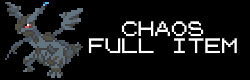
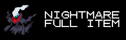
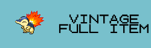
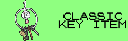

# EmoTracker pack for Pokémon Crystal Randomizers

Based on the tracker by StormRider, modified by DillonIsMyName and Vicendithas

It's an EmoTracker pack with map for\
[ERC's Pokémon Crystal Item Randomizer](https://github.com/erudnick-cohen/Pokemon-Crystal-Item-Randomizer)

## Requirements
[EmoTracker](https://emotracker.net/)

## Installation

1. Download through the Package Manager in EmoTracker.

OR

1. Download the latest release from the Releases section on GitHub.
2. Place the downloaded zip file in the EmoTracker packs directory (defaults to ``My Documents\EmoTracker\packs``).

OR (for the development version)

1. Clone the repository to your computer
2. Place the downloaded zip file (or directory) in the EmoTracker packs directory (defaults to ``My Documents\EmoTracker\packs``). Note: if you download a zip of the repository, you may need to unzip it first.

## Usage

This tracker has a couple variants, Full Item Randomizer and Key Item Randomizer. The tracker has the following features:

1. A map containing locations of items and badges to acquire.
2. A tracker of items and badges acquired
3. Maps of several caves to help find items or traverse without Flash
4. Settings options for various randomization features

It is recommended to turn on Fast Tool Tips to see the descriptions of the items and settings options

### Settings Options

If the option is crossed out, it is disabled and not part of the logic of the tracker.

1.  All items are randomized, otherwise only Key Items are randomized. This does not include PokeGear, PokeGear Cards, Pokedex, or Rainbow Wing (see the other options below for these).
2.  Adds hidden items into the pool (only makes sense to use with Full Item). Does not include the Machine Part location, since that is included by default.
3.  The tree in Ilex Forest is present, requiring access to Cut to pass.
4.  Clair forces you to go to Dragon's Den and pass the test before giving you the badge and item (requires Surf and Whirlpool).
5.  Fighting the Elite Four is required for Red to appear.
6.  Going into Western Kanto via the Victory Road gate is in logic (requires Surf, Waterfall, and waking up Snorlax, which requires the PokeGear, Radio Card, and Expansion Card).
7.  The Pokedex is added to the randomized item pool.
8.  The PokeGear is added to the randomized item pool.
9.  The Radio Card and Expansion Card are added to the randomized item pool.
10.  The Rainbow Wing is added to the randomized item pool. Tin Tower and the Ho-oh Treasure Room are in logic. Access to the base of Tin Tower requires the Clear Bell and access to the upper floors requires the Rainbow Wing. Ho-oh spawns once the Elite Four have been defeated. The Ho-oh Treasure Chamber opens when Ho-oh has been defeated (requires Surf and Strength).

### Settings Presets

Presets have been added under the gear icon at the top right of the item tracker, corresponding with the presets in ERC's Item Randomizer.

1.  Standard Full Item randomizer.
2.  Easy Full Item randomizer (same as Standard, but with a few Easy settings, see below).
3.  Tricky or Extreme Full Item randomizer (adds PokeGear, Radio/Expansion Cards, Pokedex, and Tin Tower to logic).
4.  Chaos Full Item randomizer (same as Extreme, but hidden items locations are added).
5.  Nightmare Full Item randomizer. Do you like fun? Well, too bad.
6.  Vintage Full Item randomizer (replicates vanilla Crystal as close as possible).
7.  Classic or Easy Key Item randomizer (see below for Easy variant information).
8.  Neo or Extreme Key Item randomizer (new twists on Key Item Randomizer).

The Extreme variants mixes badges into the item pool. This does not change how the tracker operates, but is noted here for convenience.\
The Easy variants guarantee early Fly access (follows early Bicycle logic), Backwards Kanto is never required, and none of the Kanto Gym leaders (except Janine) will be required until access to 7 other badges.

Note: After using these presets, you can further customize your settings options as normal.

## Bugs? Suggestions?

Feel free to report them by opening an issue on
[the GitHub repository](https://github.com/Vicendithas/pokemon-crystal-randomizer-tracker).

## Thanks
StormRider for the original tracker\
ZaidusRecon for the detailed maps\
Pret whose combined efforts on Pokemon disassembly have made these kinds of randomizer possible\
Dabomstew for the Universal Pokemon Randomizer and the Crystal Speedchoice projects that make randomization and speedrunning easier\
Pokemon Randomizer community
