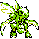
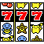
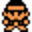
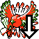
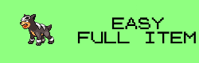
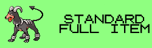
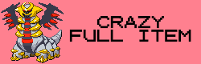
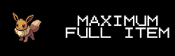
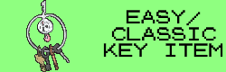

# EmoTracker pack for Pokémon Crystal Randomizers

Based on the tracker by StormRider, modified by DillonIsMyName and Vicendithas

It's an EmoTracker pack with map for\
[ERC's Pokémon Crystal Item Randomizer](https://github.com/erudnick-cohen/Pokemon-Crystal-Item-Randomizer)

## Requirements
[EmoTracker](https://emotracker.net/)

## Installation

1. Download through the Package Manager in EmoTracker.

OR

1. Download the latest release from the Releases section on GitHub.
2. Place the downloaded zip file in the EmoTracker packs directory (defaults to ``My Documents\EmoTracker\packs``).

OR (for the development version)

1. Clone the repository to your computer
2. Place the downloaded zip file (or directory) in the EmoTracker packs directory (defaults to ``My Documents\EmoTracker\packs``). Note: if you download a zip of the repository, you may need to unzip it first.

## Usage

This tracker has a wide variety of variants to support the options available in ERCs Crystal Item Randomizer, including the following features:

1. A map containing locations of items and badges to acquire.
2. A tracker of items and badges acquired
3. Maps of several caves to help find items or traverse without Flash
4. Settings options for various randomization features
5. Preset buttons to quickly set the options

It is recommended to turn on Fast Tool Tips to see the descriptions of the items and settings options.

### Settings Options

If the option is crossed out, it is disabled and not part of the logic of the tracker. Key Items and Badges are always in the pool.

1.  Adds all visible item balls and most NPC items (see the other modifiers for exception for what is not included in this modifier)
2.  Adds hidden items.
3.  TMs (and the Map Card) will be shown regardless of mode selected. This is primarily for the KIR+TM modes, but can be used in other modes that don't normally show these items.
4.  Adds items locked by day, time, or happiness (requirements changed to always be available).
5.  Adds berry and Apricorn trees.
6.  Adds Rainbow Wing (Elite Four), Tin Tower (Defeat Morty or Radio Tower, Clear Bell for 1st Floor, Rainbow Wing for upper floors), and the Ho-oh Treasure Room (Elite Four or Nerf Ho-oh, and Surf).
7.  Adds the Bug Catching Contest (4 total checks for 1st, 2nd, 3rd, and consolation places).
8.  Adds the trainers that will give you their phone number and offer items.
9.  Adds the checks locked by specific Pokemon (Bill's Grandfather, Elm's Everstone, Lake of Rage Biggest Magikarp, and some of the phone call trainers).
10.  Adds marts and other shops (such as vending machines or bargain shops).
11.  The tree in Ilex Forest is present, requiring Cut to pass.
12.  Clair forces you to go to Dragon's Den and pass the test before giving you the badge and item (requires Surf and Whirlpool).
13.  Adds the GS Ball to the pool. Requires Elite Four and is obtained by entering and exiting the Goldenrod Pokemon Center.
14.  Adds the Game Corners for both Goldenrod and Celadon. Both require Coin Case, and the Goldenrod GC has a soft requirement of defeating Radio Tower.
15.  Adds Buena's Password. Requires Blue Card and a soft requirement of defeating Radio Tower.
16.  Opens Mt. Silver so that the player can access it as soon as the League Gate is accessible.
17.  Going into Western Kanto via the Victory Road gate is in logic (requires Surf, Waterfall, and waking up Snorlax, which requires the PokeGear, Radio Card, and Expansion Card).
18.  Adds a few less than useful checks into the pool.
19.  Fighting the Elite Four is required for Red to appear.
20.  Ho-oh will always be available (even without beating E4), allowing access to the Ho-oh Treasure Chamber earlier.
21.  Value can be modified to indicate how many badges are required before Professor Oak in Pallet Town will allow access to Mt. Silver/spawn Red (depending on other modifiers).

Notes:
1. With the "Hidden Items" modifier and/or the "Day and Happiness Items", the items underneath Wesley (Lake of Rage) and Frieda (Route 32), are moved to be in front of them.
2. With the "Hidden Items" modifier, Mt. Moon Clefairy Square Moon Stone is not included.
3. However, with "Hidden Items" and "Day and Happiness Items" modifiers, Clefairy Square item is available.

### Settings Presets

Presets have been added under the gear icon at the top right of the item tracker, corresponding with the presets in ERC's Item Randomizer.

1.  Easy Full Item randomizer (same as Standard Full Item, but with a few Easy settings, see below).
2.  Standard Full Item randomizer.
3.  Vintage Full Item randomizer (replicates vanilla Crystal in some ways).
4.  Standard Full Item randomizer, but with some extra twists
5.  Standard Full Item randomizer, but with some extra twists
6.  Crazy Full Item randomizer (same as Extreme, but day and happiness locked items and berry trees are added).
7.  Every item in the game (including hidden items) is in the pool.
8.  Nightmare Full Item randomizer. Do you like fun? Well, too bad.
9.  Easy or Classic Key Item randomizer. (see below)
10.  Tricky or Extreme Key Item randomizer. (see below)

The Tricky variant adds PokeGear, Radio/Expansion Cards, Pokedex, and Tin Tower into the item pool.\
The Extreme variants is the same as Tricky, but it also mixes badges into the item pool.\
The Easy variants guarantee early Fly access (follows early Bicycle logic), Backwards Kanto is never required, and none of the Kanto Gym leaders (except Janine) will be required until access to 7 other badges.

Note: After using these presets, you can further customize your settings options as normal.\
For example, if you want to add Hidden Items to Extreme, you can select the Extreme preset, then add the Hidden Items modifier manually.

## Notes

Leftovers (in Celadon City) are now included in the tracker regardless of the preset/settings.\
The rationale behind this:
1. If the "Derandomize Leftovers" modifier in the Item Randomizer is used, then this item will always be Leftovers, and is probably worth grabbing (it's a good item to have).
2. If the "Shuffle Leftovers" modifier in the Item Randomzier is used, then this location will be part of the item pool, and may contain a required item.
The only time it wouldn't matter is if both of those modifiers are omitted. In that case, it will be a random junk item, but it's easier to just include it on the map regardless.

## Bugs? Suggestions?

Feel free to report them by opening an issue on
[the GitHub repository](https://github.com/Vicendithas/pokemon-crystal-randomizer-tracker).

## Thanks
StormRider for the original tracker\
ZaidusRecon for the detailed maps\
ERC for his work on the Crystal Item Randomizer\
Chaotix on their work adding even more items to the Crystal Item Randomizer\
461weavile for their work on adding Shopsanity to this pack\
Snowbear22 for his work in suggesting the original tracker to StormRider and helping keep this tracker up to date and bug free\
Pret whose combined efforts on Pokemon disassembly have made these kinds of randomizer possible\
Dabomstew for the Universal Pokemon Randomizer and the Crystal Speedchoice projects that make randomization and speedrunning easier\
Pokemon Randomizer community

## TODO (future plans)

1. Update maps to include every route, cave, and building where items are located.
2. Update Post-Rocket Shop in Mahogany to include beating Clair as a possible unlock
